# Module Dependency Graph & Hierarchy

This document maps all import connections, module responsibilities, leaf node classifications, circular dependency checks, and suggestions for future coupling reductions.

---

## 🗺️ Mermaid Dependency Diagram

The following diagram illustrates how modules link together, flowing from bootstrapping nodes down to leaf utilities:

```mermaid
graph TD
    %% Main Entry Points
    main[public/js/main.js] --> bootstrap[public/js/core/bootstrap.js]
    main --> preloader[public/js/core/preloader.js]
    main --> spells[public/js/effects/spells.js]

    %% Preloader Bootstrappings
    preloader --> state[public/js/core/state.js]
    preloader --> constants[public/js/core/constants.js]
    preloader --> config[public/js/core/config.js]
    preloader --> events[public/js/core/events.js]
    preloader --> buttons[public/js/ui/buttons.js]
    preloader --> modal[public/js/ui/modal.js]
    preloader --> envelope[public/js/story/envelope.js]
    preloader --> parallax[public/js/ui/parallax.js]
    preloader --> parchment[public/js/story/parchment.js]
    preloader --> particles[public/js/animation/particles.js]
    preloader --> ambienceMgr[public/js/environment/ambienceManager.js]
    preloader --> audioAmbience[public/js/audio/ambience.js]

    %% Events & States
    events --> state
    events --> helpers[public/js/core/helpers.js]
    events --> particles

    %% Audio System Layer
    audioAmbience --> audioEngine[public/js/audio/audioEngine.js]
    audioAmbience --> wind[public/js/audio/wind.js]
    audioEngine --> state
    wind --> state
    adaptiveMusic[public/js/audio/adaptiveMusic.js] --> audioEngine
    adaptiveMusic --> state
    ceremony[public/js/audio/ceremony.js] --> audioEngine

    %% Effects & Spells Layer
    spells --> state
    spells --> constants
    spells --> helpers
    spells --> audioEngine
    spells --> audioAmbience
    spells --> narrative[public/js/story/narrative.js]
    spells --> castleReveal[public/js/story/castleReveal.js]
    spells --> modal
    spells --> particles

    %% Environment & Canvas particles
    ambienceMgr --> state
    ambienceMgr --> seasons[public/js/environment/seasons.js]
    ambienceMgr --> fireflies[public/js/effects/fireflies.js]
    ambienceMgr --> dust[public/js/effects/magicalDust.js]
    ambienceMgr --> feathers[public/js/effects/feathers.js]
    ambienceMgr --> stars[public/js/effects/shootingStars.js]
    ambienceMgr --> birds[public/js/environment/birds.js]
    ambienceMgr --> owl[public/js/environment/owl.js]
    ambienceMgr --> butterflies[public/js/effects/butterflies.js]
    ambienceMgr --> creatures[public/js/environment/creatures.js]
    ambienceMgr --> weather[public/js/environment/weather.js]
    ambienceMgr --> moon[public/js/environment/moon.js]
    ambienceMgr --> smoke[public/js/effects/smoke.js]

    %% Story Timelines
    envelope --> state
    envelope --> constants
    envelope --> helpers
    envelope --> audioAmbience
    envelope --> adaptiveMusic
    envelope --> wishCeremony[public/js/story/wishCeremony.js]
    envelope --> castleReveal
    envelope --> narrative
    envelope --> buttons
    envelope --> modal
    
    castleReveal --> state
    castleReveal --> narrative
    castleReveal --> ambienceMgr
    
    wishCeremony --> state
    wishCeremony --> adaptiveMusic
    wishCeremony --> ceremony
    wishCeremony --> particles
    
    narrative --> state
    narrative --> constants
    narrative --> storage[public/js/core/storage.js]
    narrative --> particles

    %% UI & Helper Bindings
    buttons --> state
    buttons --> constants
    buttons --> audioEngine
    modal --> state
    modal --> constants
    modal --> helpers
    modal --> config
    modal --> buttons
    parallax --> state
    parchment --> state

    %% Helper Leaf Nodes
    config --> constants
    seasons --> helpers
    fireflies --> helpers
    dust --> helpers
    feathers --> helpers
    stars --> helpers
    birds --> helpers
    owl --> helpers
    butterflies --> helpers
    creatures --> helpers
    smoke --> helpers
    particles --> state
    particles --> helpers

    classDef leaf fill:#d1e7dd,stroke:#0f5132,stroke-width:1px;
    classDef central fill:#fff3cd,stroke:#664d03,stroke-width:1px;
    class state,constants,helpers,storage,audioEngine leaf;
    class preloader,envelope,spells,ambienceMgr,particles central;
```

---

## 🏷️ Node Classification

### 1. Central Modules
These modules coordinate subsystems, load sub-components, and manage high-level logic:
- **`public/js/main.js`**: Application entry point.
- **`public/js/core/preloader.js`**: Core preloader bootstrap node, instantiating environment managers.
- **`public/js/effects/spells.js`**: Distributes text triggers to active spell canvas targets.
- **`public/js/story/envelope.js`**: Central timeline coordinator for envelope unsealing.
- **`public/js/environment/ambienceManager.js`**: Primary canvas loop drawing stars, owls, butterflies, and stags.

### 2. Leaf Nodes (No Outgoing Dependencies)
These modules perform specific tasks and do not import other modules. They are easy to unit-test:
- **`public/js/core/state.js`**: Shared reactive data dictionary organized by domain namespaces.
- **`public/js/core/bootstrap.js`**: DOMContentLoaded wrapper with auto-cleanup properties.
- **`public/js/core/constants.js`**: Settings registry for house colors and default file sizes.
- **`public/js/core/helpers.js`**: General math, range limits, and focus trapping.
- **`public/js/core/storage.js`**: Read/write access counts to localStorage.
- **`public/js/environment/weather.js`**: Calculates time of day gradients.
- **`public/js/environment/moon.js`**: Draws moon masks dynamically.

---

## 🔍 Coupling & Circular Import Analysis

- **Circular Dependencies**: **None detected**. The dependency flows down from `main.js` and `preloader.js` to specific sub-layers, then terminates at leaf helpers (`helpers.js`, `state.js`, and `bootstrap.js`), forming a completely directed acyclic graph.
- **Coupling Reduction Progress**:
  - Encapsulated all global variables in domain namespaces (`state.audio`, `state.story`, `state.pointer`, `state.spells`, etc.).
  - Moved high-frequency pointer capture events out of individual managers and into a single LERP loop inside `public/js/core/events.js`.
  - Exposed direct module APIs (`startMusic`, `triggerOwlDelivery`, `spawnSparkCluster`, and `triggerAwakeningOwls`) to remove all executable callbacks from the state dictionary.
