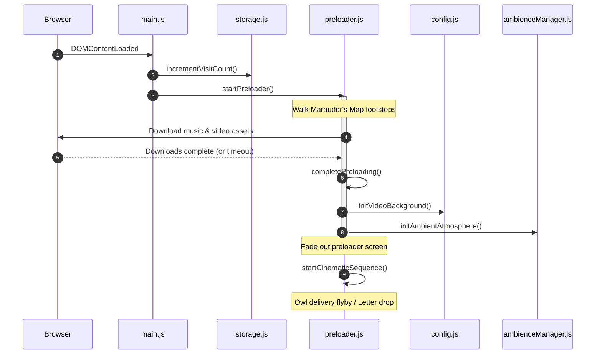

# Project Architecture & Code Map

This document describes the codebase architecture, file layout, initialization order, and coding patterns of the Hogwarts Birthday project.

---

## 📂 File Architecture

The project contains no package managers or complex build pipelines. It is structured into standard logical layers:

```
New_birthday/
├── index.html            <- Semantic DOM layout and SVG asset templates
├── content.js            <- Global, user-editable configuration file
│
└── public/
    ├── css/
    │   ├── base/         <- Typography, variables, keyframe animations, resets
    │   ├── layout/       <- Modal layers, envelopes, parchment, dock buttons
    │   ├── ambience/     <- Fog transitions, moon glows, clouds, canvas dimensions
    │   └── main.css      <- Bundling stylesheet using imports
    │
    └── js/
        ├── core/         <- State dictionary, constants, focus controls, config
        ├── animation/    <- Star sparkles canvas engine
        ├── audio/        <- AudioContext, wind, crystal bell chord synths
        ├── environment/  <- Seasons logic, moon phase mask, bird paths, stag
        ├── story/        <- 3D envelopes, letter reveal loops, wish ceremonies
        ├── ui/           <- Modal overlays, audio controls, device parallax sways
        ├── effects/      <- Spell effects, fireflies, butterflies, smoke
        └── main.js       <- Main entry point bootstrap script
```

---

## ⚙️ Module Responsibilities

### 1. Core Layer (`public/js/core/`)
- **`constants.js`**: Holds read-only settings (colors, default sizes, spell names, emoji listings, and character coordinates).
- **`state.js`**: Holds the global state dictionary (`state.opened`, `state.currentHouse`, `state.chestUnlocked`, `state.revelioCast`, `state.firstLetterRead`). Decouples data from visual components.
- **`helpers.js`**: Basic utility functions, standard linear interpolation (LERP), keyboard focus trapping, viewport VH locks, and random range wrappers.
- **`storage.js`**: Governs LocalStorage read/write routines (visit counts, unlocked spells).
- **`config.js`**: Instantiates overlapping background video buffers (`bg-video` and `bufferVideo`) and coordinates cross-fades.

### 2. Audio Layer (`public/js/audio/`)
- **`audioEngine.js`**: Manages Web Audio Context creation and user gesture unlock triggers.
- **`adaptiveMusic.js`**: Integrates a dynamic lowpass filter and gain ramp controls to shift background soundtrack filters based on letter open/closed states.
- **`wind.js`**: Synthesizes real-time white noise modulated by an LFO to simulate ambient weather.
- **`ceremony.js`**: Plays peaceful crystal glass harp chimes using detuned sine wave frequencies.
- **`ambience.js`**: Plays procedural bird chirps during the day and owl hoots at night.

### 3. Environment Layer (`public/js/environment/`)
- **`seasons.js`**: Detects season by month and returns particle types (petals, leaves, snow).
- **`weather.js`**: Sets overlays matching times of day (Sunrise, Afternoon, Sunset, Night).
- **`moon.js`**: Calculates the lunar cycle stage for the current date and draws the SVG mask dynamically.
- **`birds.js`**: Draws background birds sliding along bezier curves.
- **`owl.js`**: Governs the perching, blinking, and startled fly-away behaviors of the curious owl.
- **`creatures.js`**: Orchestrates the walking, fading, and sparkle trails of the Patronus stag.
- **`ambienceManager.js`**: Houses the main continuous canvas rendering requestAnimationFrame loop.

### 4. Story Layer (`public/js/story/`)
- **`envelope.js`**: Tracks 3D card tilts, seal cracks, and unseal transitions.
- **`parchment.js`**: Controls letter modal unfolding, drop caps, scroll bounds, and swipe-to-dismiss gesture handling.
- **`narrative.js`**: Prepends time-aware greetings and welcome back lines into scroll paragraphs.
- **`wishCeremony.js`**: Orchestrates the emotional wish ceremony sequence (dimming lights, drawing constellations, moonbeam sweeps, and rising golden embers).
- **`castleReveal.js`**: Handles the castle reveal sequence (cathedral bells, detuned choir drones, candle ignitions).

### 5. UI & UI Effects Layer (`public/js/ui/` & `public/js/effects/`)
- **`buttons.js`**: Manages music play/pause toggling.
- **`parallax.js`**: Leverages pointer/gyroscope coordinates to shift variables `--mx`/`--my`.
- **`spells.js`**: Processes typing spells, triggering overlays like Glacius scratch canvas, Fumos mist, and Accio card rotations.
- **`particles.js`**: Manages the `<canvas id="sparkle-canvas">` trail engine.

---

## 🔄 Initialization Order

When a user visits the website, the subsystems trigger in a precise sequential timeline:



### Timeline Phase Details
1. **Bootstrap Phase**: Browser loads `index.html` and parses `content.js` to create the global config object. It registers `public/js/main.js` as an ES6 module.
2. **Preload Phase**: `startPreloader()` runs, increments visit counters in LocalStorage, starts walking footprints, and concurrent fetch downloads run.
3. **Core Activation Phase**: On download completion (or 15s timeout), the preloader fades out. `initVideoBackground()` creates the background video buffer, `initAmbientAtmosphere()` initializes the background canvas loop, and `initEnvelope()` configures card listeners.
4. **Cinematic Entry**: The preloader launches `startCinematicSequence()`. The owl flies across the moon, scales up, drops the letter, and a snap sound is synthesized.
5. **Interactive Loop**: The page unlocks, allowing the user to click crests, type spells, or tap the envelope to open the letter.

---

## 🎨 CSS Styling Architecture

The design system is split into three modular namespaces loaded by [main.css](file:///c:/Users/anian/Downloads/IMP_2/New_birthday/public/css/main.css):

1. **`css/base/`**:
   - `reset.css`: Standard margins, scroll-behaviors, box-sizing, and body locks.
   - `variables.css`: Global variables mapped to oklch house parameters, wind sways, and transition durations.
   - `typography.css`: Setup for IM Fell English, Cinzel, Lora, and custom vector signature stroke values.
   - `animations.css`: Keyframes for typewriter blinks, confundo wobbles, wet-ink bleeding, and floating candles.
   - `utilities.css`: Translucent screen masks and screen reader helpers (`.sr-only`).
2. **`css/layout/`**:
   - `app.css`: Body house themes.
   - `envelope.css`: 3D folding flaps, seals, address text blocks.
   - `parchment.css`: Scroll paper overlays, deckle-edge vector clip paths, and signature strokes.
   - `landing.css`: Floating bottom controls dock buttons, spell tags.
   - `modal.css`: Centered house selector card.
   - `castle.css`: Castle towers, flicker window styles.
   - `responsive.css`: Screen size adjustments.
3. **`css/ambience/`**:
   - `weather.css`: Time of day gradient shifts.
   - `moon.css`: Moon glow.
   - `fog.css`: Volumetric fog layers.
   - `candles.css`: Bobbing float values.
   - `particles.css`: Canvas overlays.
   - `creatures.css`: Perched owls, feathers, white stag filters.
